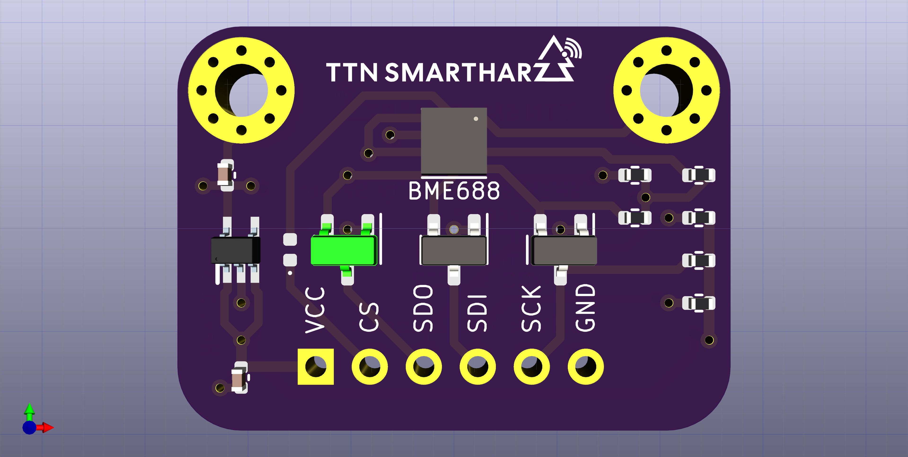
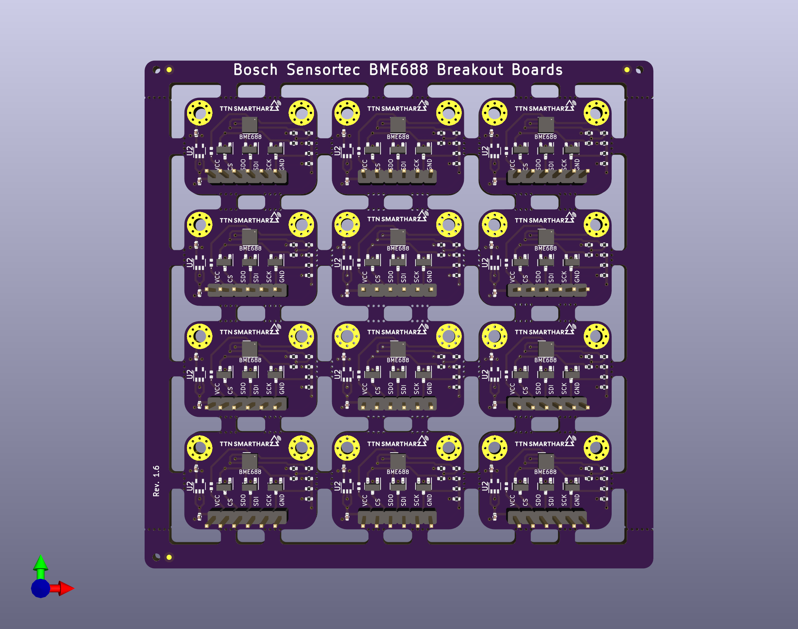

# Bosch Sensortec BME688 Breadboard Adapter

A simplistic sensor base board for BME688 air quality sensor by Bosch Sensortec

The design allows for VCC and logic levels between 3V3 and 5V DC.

Due to the fact that the BME688 sensor features an LGA footprints with all pads below the sensor, manual soldering with a soldering iron is not possible for the sensor itself. All other parts can be soldered by hand, even though the 0402 components require a steady hand. Either way reflow soldering makes life a lot easier, if you keep the airflow low enough to not blow away your components. :wink:

The project folder [panel](/Sensor_BaseBoard/panel/) contains a panelized version as well

