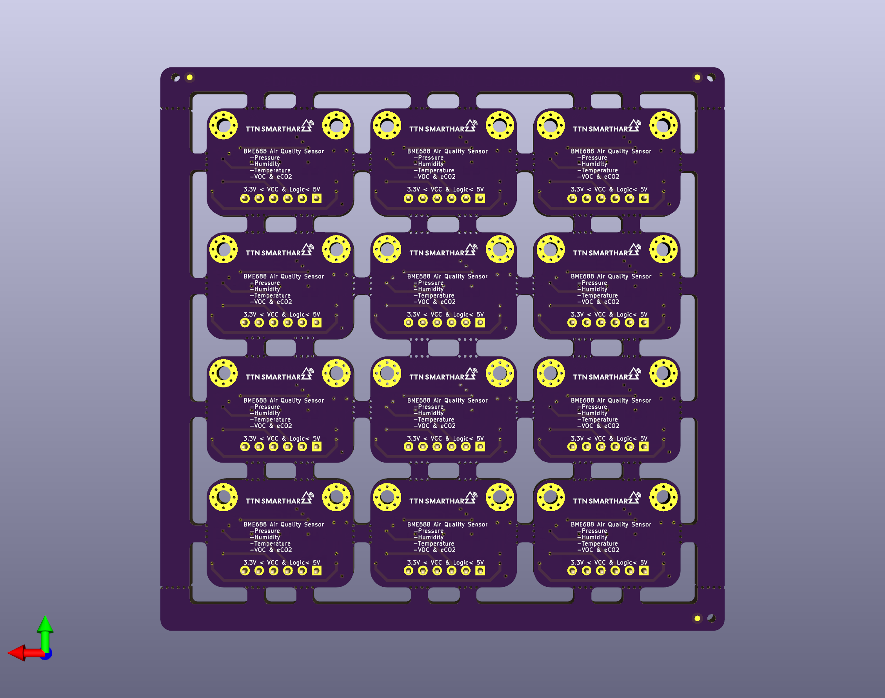

# Bosch Sensortec BMEx80 Breadboard Adapter

This folder contains the [KiCAD](https://www.kicad.org/) project for a panelized version of the adapter.
The initial panel was generated using the kikit extension for KiCAD and afterwards cleaned up.

As I prefer the look and feel I went with ENIG for manufacturing, but HASL lead free is of course perfectly fine as well.

You can find a condensed version of the layout as PDF [here](BME688_Breakout_Board_Panel_Condensed.pdf).
