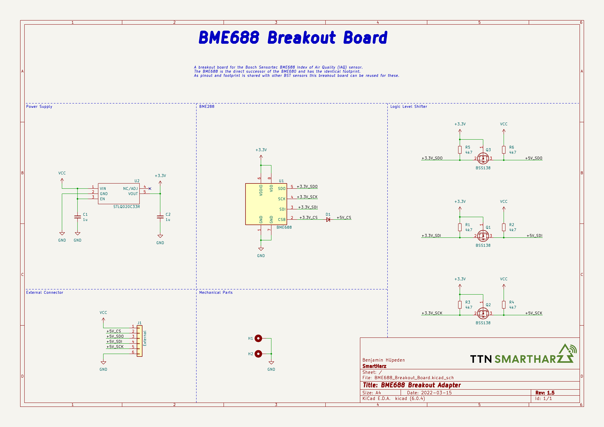
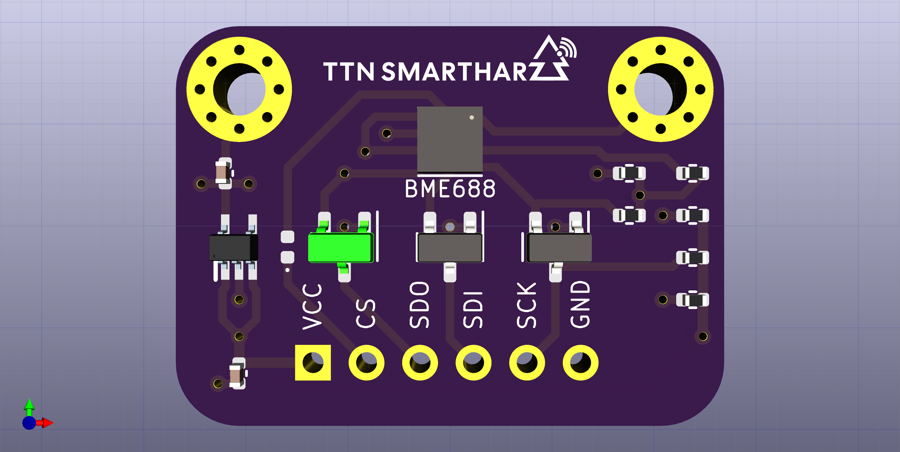
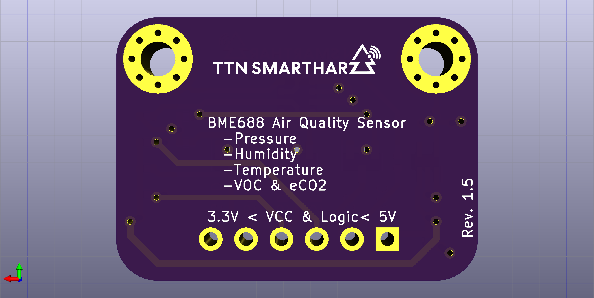

# Bosch Sensortec BMEx80 Breadboard Adapter

This folder contains the [KiCAD](https://www.kicad.org/) project for the single adapter.

## Schematic

PDF of the schematic is available [here](BME688_Breakout_Board_Schematic.pdf).

## Layout

As 4 layer boards nowadays are available at a similar price as 2 layer boards, I went for 4 layers, with dedicated GND and 3V3 planes in the middle.

A PDF of the layout is available [here](BME688_Breakout_Board_SingleLayers.pdf)(single page per layer) and [here](BME688_Breakout_Board_Condensed.pdf)(all layers condensed).
